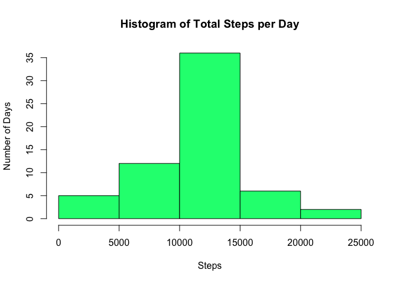

# Reproducible Research: Peer Assessment 1

## Importing necessary libraries

```r
suppressMessages(require(dplyr))
suppressMessages(require(ggplot2))
```

## Loading and preprocessing the data

```r
unzip("activity.zip")
activity.data <- read.csv("activity.csv")
```


## What is mean total number of steps taken per day?

```r
agg.date <- aggregate(steps ~ date, activity.data, sum)
hist(agg.date$steps, 
     col = "springgreen",
     xlab = "Steps",
     ylab = "Number of Days",
     main = "Histogram of Total Steps per Day")
```

<!-- -->


## What is the average daily activity pattern?

### Mean and median steps per day

```r
mean.steps <- mean(agg.date$steps)
median.steps <- median(agg.date$steps)
# Mean steps per day
mean.steps
```

```
## [1] 10766.19
```

```r
# Median steps per day
median.steps
```

```
## [1] 10765
```
### Time series plot of the average number of steps taken

```r
agg.interval <- aggregate(steps ~ interval, activity.data, mean)
p <- qplot(interval, steps, data = agg.interval, geom = "line") 
p <- p + xlab("Interval")
p <- p + ylab("Average Steps per Day")
p <- p + ggtitle("Time Series of Average Steps per Day")
print(p)
```

<!-- -->

### The 5-minute interval that, on average, contains the maximum number of steps

```r
max_interval <- agg.interval[which.max(agg.interval$steps), ]
print (max_interval)
```

```
##     interval    steps
## 104      835 206.1698
```

## Imputing missing values

### Count of missing values in dataset

```r
missing <- activity.data[is.na(activity.data$steps), ]
missing.count <- dim(missing)[1]
```
- Here is the missing count: 2304

### Missing steps data will be replaced with the mean for the corresponding interval

```r
complete <- activity.data
# for each row...
for (i in seq(nrow(complete))) {
    # check if steps is NA
    if (is.na(complete[i, 1])) {
        interval <- complete[i, 3]
        interval.index <- which(agg.interval$interval == interval)
        imputed <- agg.interval[interval.index, ]
        imputed.steps <- imputed[, 2]
        # assign activity.data row to average steps
        # for that interval
        complete[i, 1] <- imputed.steps
    }
}

agg.complete.date <- aggregate(steps ~ date, complete, sum, na.rm = T)
hist(agg.complete.date$steps, 
     col = "springgreen",
     xlab = "Steps",
     ylab = "Number of Days",
     main = "Histogram of Total Steps per Day")
```

<!-- -->

### Mean and median steps per day with complete cases

```r
mean.complete.steps <- mean(agg.complete.date$steps)
median.complete.steps <- median(agg.complete.date$steps)
# Mean steps per day
mean.complete.steps
```

```
## [1] 10766.19
```

```r
# Median steps per day
median.complete.steps
```

```
## [1] 10766.19
```

My analysis did not reveal any significant differences between the mean and median values 
for the raw activity data and activity data with imputed values.


```r
difference.mean <- mean.complete.steps - mean.steps
```

The difference between the means was 0, indicating no difference/change.


```r
difference.median <- median.complete.steps - median.steps
```

The difference between the medians was 1.1887 (mean.complete.steps - mean.steps)

## Are there differences in activity patterns between weekdays and weekends?

```r
weekend.days <- c("Saturday", "Sunday")
categories <- c("weekday", "weekend")

complete$weekday <- factor(weekdays(as.Date(complete$date, "%Y-%m-%d")) %in% weekend.days * 1,
                           labels = categories)

agg.complete <- aggregate(steps ~ interval + weekday, complete, mean) 

p <- qplot(interval, steps, data = agg.complete, geom = "line", facets = .~ weekday) 
p <- p + aes(color = weekday)
print(p)
```

<!-- -->

